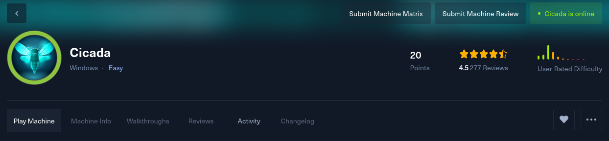
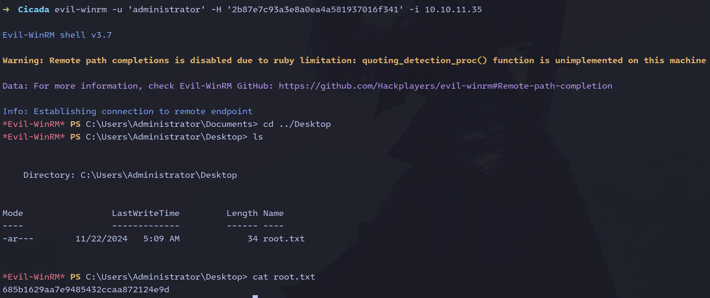

## Proceso de solución

1. **Objetivo:** Cicada - 10.10.11.35  

2. **Comprobar conexión:** Realizamos una comprobación mediante **ping** para verificar la conectividad con la máquina: 

      
    
    Mediante **ping-ttl** podemos determinar el sistema operativo al cual nos enfrentamos: **Linux** (ttl -> 64) | **Windows** (ttl -> 128).  
    **(Estos valores son facilmente editables).**  

3. **Enumeración de puertos:** Por medio de nmap realizamos una enumeración de puertos abiertos, guardando el resultado en un archivo .txt:    

    `nmap -p- --open -sS --min-rate 5000 -Pn -oG ports.txt 10.10.11.35`  

      

    Encontramos servicios como DNS,LDAP o LDAPSSL.  

4. **Obtener detalles de servicios:** Realizo una búsqueda de servicios y sus versiones, adicionalmente verifico si existe alguna vulnerabilidad:  

    `nmap -sCV -oN scanv.txt 10.10.11.35`  

    

    - Confirmamos que nos encontramos frente a una máquina de Windows.
    - Debido a los servicios encontrados, empiezo por revisar LDAP.
    - Mediante este resultado extraemos el dominio: **CICADA.HTB**  

5. **LDAPSearch:** Mediante la aplicación **ldapsearch** realizo una búsqueda del servidor, pero no logro extraer información:

    

6. **Crackmapexec:** Procedo a usar la aplicación **crackmapexec** para tratar de extraer información de usuarios y recursos compartidos. (Realizo la búsqueda sin usuario y con el usuario 'Guest'):  

      

    **¡EL usuario Guest tiene acceso al directorio 'HR'!**  

7. **Carpeta HR:** Uso **smbclient** para entrar al folder **HR** con el usuario **Guest** y ver su contenido.  

    

    Optengo una contraseña y procedo a almacenarla en un archivo **passwords.txt**.  

8. **LDAP fuerza bruta:** Ya que aún no encuentro usuarios para poder realizar una búsqueda más específica, realizo una búsqueda de usuarios con **crackmapexec** pero esta vez usando fuerza bruta:  

    

    Optengo usuarios los cuales procedo a almacenar en el archivo **users.txt**.  

9. **Fuerza bruta Especifica:** Mediante el archivo **passwords.txt** y el archivo **users.txt** proceso a revisar si logro obtener un usuario y contraseña válidos:

    

    Ahora tengo un usuario válido con la contraseña que estaba pública.

10. **Enumeracion de informacion en el dominio:** Procedo a buscar si el usuario que encontré tiene acceso a otro folder en el servidor **SMB**, pero ya que no encuentro nada relevante, utilizo este usuario para tratar de enumerar información del dominio.

    

    **Crackmapexec** busca información de los usuarios del dominio. Entre esta información se encuentra la descripción de cada usuario, y veo que un usuario tiene en su descripción su contraseña, la cual agrego al archivo **passwords.txt**.  

11. **Enumeracion SMB:** Uso el usuario y password encontrados para listar si tengo acceso a otras carpetas del servidor.

      

    Este usario tiene acceso al folder **/DEV**  

12. **Carpeta DEV:** Procedo a entrar a este folder y extraer la información que encuentre que me sea útil, encontrando un usuario y una contraseña, los cuales agrego a los archivos de control:  

    

13. **Acceso Remoto:** Ya que el usuario optenido realiza tareas de backup, pruebo si tiene acceso remoto mediante **evil-winrm**:

    

    **¡Optengo acceso remoto!**

14. **Primera Bandera:** En la ubicación **'C:\Users\emily.oscars.CICADA\Desktop'** encontramos la primera bandera de usuario:

    

15. **Escalada de privilegios:** Ya teniendo acceso revisamos si podemos escalar privilegios con este usuario, utilizo el comando **whoami /priv** para observar los permisos que tiene el usuario:

    

    Encuentro privilegios para realizar tareas de backup y busco en internet si existe alguna manera de explotar estos permisos encontrando el siguiente post: [SeBackupPricilege](https://fuzz3d.github.io/posts/sebackuprivilege/). 

16. **Opteniendo los archivos SAM y SYSTEM:** procedemos a generar los archivos **SAM** y **SYSTEM** los cuales nos permitiran obtener hash de los usuarios críticos entre ellos 'Administrator'.  

      

17. **Pypykatz para SAM y SYSTEM:** Mediante la aplicacion **pypykatz** podemos procesar los archivos **SAM** y **System** y obtener los hash de los usuarios críticos:  

      

18. **Accediando como Administrator** Ya teniendo el hash de acceso del usuario administrador, usamos **evil-winrm** para loguearnos con este hash:

    

### Maquina solucionada.        